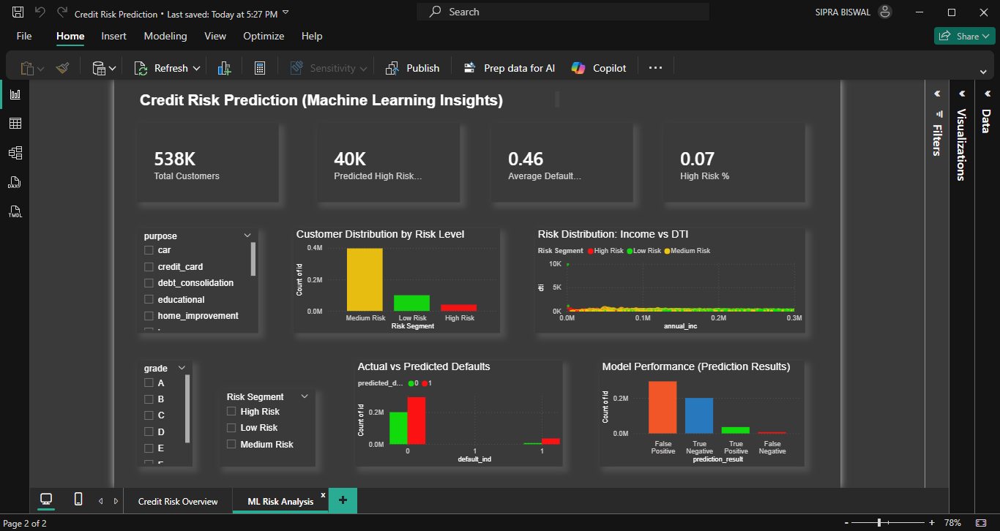

# 💳 Credit Risk Analysis & Loan Default Prediction (End-to-End Data Project)

    

---

## 📌 Project Overview
This project builds an end-to-end **Credit Risk Analytics & Default Prediction System** using real-world loan data.

It integrates:
- **SQL** for business analysis  
- **Python** for data processing & machine learning  
- **Power BI** for interactive dashboards  

👉 Objective: Enable **data-driven credit decisions** and proactively identify high-risk borrowers.

---

## 🎯 Business Problem
Financial institutions face significant losses due to loan defaults.

Key challenges:
- Identifying high-risk customers before loan approval  
- Understanding drivers of default behavior  
- Balancing profitability with risk exposure  

👉 This project addresses these challenges using **analytics + predictive modeling**.

---

## 🔄 Project Workflow
1. Data Understanding  
2. Data Cleaning & Preprocessing  
3. Exploratory Data Analysis (EDA)  
4. SQL Business Analysis  
5. Feature Engineering  
6. Machine Learning Modeling  
7. Threshold Optimization  
8. Dashboard Development (Power BI)  
9. Insights & Recommendations  

---

## ❓ Analytical Questions Explored
- Which loan grades have the highest default rates?  
- How does income level influence default probability?  
- Does DTI (Debt-to-Income Ratio) significantly impact risk?  
- Which loan purposes are more prone to default?  
- What defines a high-risk borrower?  
- How accurately can defaults be predicted?  

---

## 📊 Dataset Description
The dataset includes loan-level financial and borrower information:

- `loan_amnt` → Loan Amount  
- `int_rate` → Interest Rate  
- `annual_inc` → Annual Income  
- `dti` → Debt-to-Income Ratio  
- `grade` → Loan Grade  
- `purpose` → Loan Purpose  
- `home_ownership` → Ownership Status  
- `default_ind` → Target Variable (0 = No Default, 1 = Default)

---

## 📈 Key Performance Indicators (KPIs)
- Default Rate  
- Total Customers / Loans  
- High-Risk Customer Count  
- Predicted Default Rate  
- Model Performance Metrics  
- Risk Segment Distribution  

---

## 🧹 Data Preparation (Python)
- Removed high-missing-value columns  
- Imputed missing values using median  
- Cleaned inconsistent formats (e.g., term extraction)  
- Outlier handling:
  - Income capped at 300K  
  - Revolving utilization capped at 100  
- Removed invalid rows and parsing errors  
- Prepared dataset for modeling  

---

## 🛠 SQL Analysis
Performed business-driven analysis using SQL:

- Default rate by grade  
- Income segmentation  
- Loan size vs default behavior  
- High-risk customer identification  
- Risk segmentation logic  
- Window functions (RANK)  
- Created views & summary tables  

### Example:
```sql
SELECT CASE 
    WHEN DTI > 25 AND INT_RATE > 13 THEN 'High Risk'
    WHEN DTI > 20 THEN 'Medium Risk'
    ELSE 'Low Risk'
END AS RISK_SEGMENT,
COUNT(*) AS CUSTOMERS,
ROUND(AVG(DEFAULT_IND), 3) AS DEFAULT_RATE
FROM LOANS
GROUP BY RISK_SEGMENT;
```

---

## ⚙️ Feature Engineering

Engineered features to improve predictive performance:

- **loan_income_ratio** → Loan burden indicator  

- **risk_score** (composite feature based on):
  - High DTI  
  - High Interest Rate  
  - Low Income  

- **Binary flags**:
  - high_dti  
  - high_int_rate  
  - low_income  

---

## 🤖 Machine Learning Model

**Model Used:** Logistic Regression  

### Features:
- Loan Amount  
- Interest Rate  
- DTI  
- Annual Income  
- Loan-Income Ratio  
- Risk Score  

---

## 🔥 Threshold Optimization (Key Highlight)

Instead of using the default threshold (0.5), multiple thresholds were evaluated:

- 0.2  
- 0.3  
- 0.4  
- 0.5  

👉 Final threshold selected: **0.4**

✔ Improved recall for high-risk customers  
✔ Better balance between precision and recall  

---

## 📊 Model Output Enhancements

- `default_probability`  
- `predicted_default`  
- `confidence_flag`  

- `prediction_result`:
  - True Positive  
  - True Negative  
  - False Positive  
  - False Negative  

---

## 📊 Dashboard Visualization (Power BI)

### 🔹 Credit Risk Overview
- Default Rate KPI  
- Total Loans  
- High-Risk Customers  
- Default Rate by Grade  
- Default Rate by Purpose  
- Income vs DTI Distribution  

---

### 🔹 ML Risk Analysis
- Predicted High-Risk Customers  
- Risk Segmentation  
- Actual vs Predicted Defaults  
- Model Performance Breakdown  

---

## 📊 Dashboard Preview

### 🔹 Credit Risk Overview


### 🔹 ML Risk Analysis

